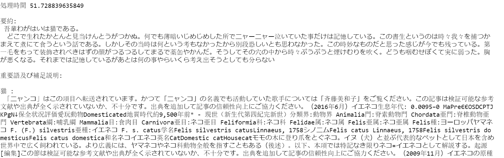

# ファイルの説明
## ファイル一覧
本プログラムは以下のファイルからなります.
* Program.ipynb  
  プログラム本体
* MakeClassEasy.ipynb  
  テキストから要約,重要語,重要語の説明を生成
* CreateAddtionalExplanation.ipynb  
  テキストから重要語,重要語の説明を取得
* bag-of-words.ipynb  
  テキストから要約を生成
* Speech2Text.ipynb  
  SpeechAPIを利用し音声ファイルからテキストファイルへ変換
* password.ipynb  
  SpeechAPIのアクセスキー,地域の設定用.  
  Speech2Text.ipynbを使う際に必要です
* sampledata.txt  
  Program.ipynbから処理されるサンプル文章

## Programの説明
Program.ipynbを実行することで,入力文章の要約,重要語,重要語についての補足説明,処理時間が出力されます.  
filepathを変更することで,好きな文章を処理することができます.  
cを変更することで,重要語の個数を制限することができます.c=-1のとき,すべての重要語を出力します.    
  
出力例:  

